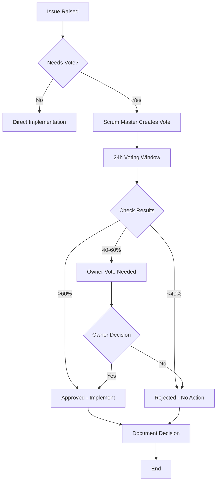

# GravityAnalysisApp - Development Workflow

## Table of Contents
1. [Project Workflow Overview](#project-workflow-overview)
2. [Sprint Structure](#sprint-structure)
3. [Democratic Decision-Making Process](#democratic-decision-making-process)
4. [Development Workflow](#development-workflow)
5. [Code Review Process](#code-review-process)
6. [Testing Workflow](#testing-workflow)
7. [Deployment Process](#deployment-process)
8. [Communication Protocols](#communication-protocols)
9. [Issue & Task Management](#issue--task-management)
10. [Emergency Procedures](#emergency-procedures)

---

## Project Workflow Overview

```
Planning → Development → Testing → Review → Deployment → Monitoring
    ↑                                                          ↓
    └────────────────── Feedback Loop ───────────────────────┘
```

---

## Sprint Structure

### Sprint Duration
**2 weeks** (10 working days)

### Week 1 Schedule

| Day | Time (UTC) | Activity | Duration | Participants |
|-----|-----------|----------|----------|--------------|
| **Monday** | 09:00 | Sprint Planning | 2 hours | All team |
| | 14:00 | Architecture Review | 1 hour | Tech Lead, Backend, DevOps |
| **Tuesday** | 09:00 | Daily Standup | 15 min | All team |
| | 10:00 | Development Time | - | All team |
| **Wednesday** | 09:00 | Daily Standup | 15 min | All team |
| | 14:00 | Technical Review | 1 hour | Tech Lead, relevant engineers |
| **Thursday** | 09:00 | Daily Standup | 15 min | All team |
| | 10:00 | Development Time | - | All team |
| **Friday** | 09:00 | Daily Standup | 15 min | All team |
| | 14:00 | Demo Preparation | 1 hour | Frontend, UX, Product |

### Week 2 Schedule

| Day | Time (UTC) | Activity | Duration | Participants |
|-----|-----------|----------|----------|--------------|
| **Monday** | 09:00 | Daily Standup | 15 min | All team |
| | 10:00 | Development Time | - | All team |
| **Tuesday** | 09:00 | Daily Standup | 15 min | All team |
| | 14:00 | Backlog Refinement | 1 hour | Scrum Master, Product |
| **Wednesday** | 09:00 | Daily Standup | 15 min | All team |
| | 10:00 | Development Time | - | All team |
| **Thursday** | 09:00 | Daily Standup | 15 min | All team |
| | 12:00 | Code Freeze | - | All team |
| | 14:00 | Final Testing | 2 hours | QA, relevant engineers |
| **Friday** | 09:00 | Sprint Review (Demo) | 1 hour | All team + stakeholders |
| | 10:30 | Sprint Retrospective | 1 hour | All team |
| | 14:00 | Sprint Planning Prep | 1 hour | Scrum Master |

---

## Democratic Decision-Making Process

### Decision Types & Voting Thresholds

#### 1. Simple Majority (7+ votes out of 12)
**Use for:**
- Feature additions
- Minor technical decisions
- Library/package choices
- Code style preferences
- Documentation updates

**Process:**
1. Issue raised by team member
2. Scrum Master creates vote
3. 24-hour voting window
4. If ≥7 votes same option → Approved
5. If <7 → Rejected or re-discussion

**Example:**
```markdown
## Vote: Add Redis for Caching

**Proposed by**: Elena Rodriguez
**Type**: Simple Majority (7+ votes needed)
**Deadline**: 2024-11-17 18:00 UTC

**Options:**
A. Implement Redis now
B. Optimize DB first, Redis later
C. No caching needed

**Vote Results**:
- Option A: 8 votes ✅ APPROVED
- Option B: 3 votes
- Option C: 1 vote

**Status**: Approved - Implementation starts Monday
```

#### 2. Super Majority (9+ votes out of 12)
**Use for:**
- Architecture changes
- Major refactoring
- Database schema changes
- Breaking API changes
- Technology stack changes

**Process:**
Same as simple majority but requires 9+ votes

#### 3. Unanimous (12 votes)
**Use for:**
- Security-critical changes
- Data deletion/migration
- License changes
- Project direction changes

**Process:**
Same but requires ALL 12 votes

#### 4. Owner Vote (40-60% Split)
**Special Rule:**
- If votes split between 40-60%, project owner gets ONE deciding vote
- Owner vote triggers automatically
- Owner has 12 hours to vote
- Owner's vote breaks the tie

**Example:**
```markdown
## Vote Result: 40-60% Split - Owner Vote Needed

**Proposed**: Migrate to PostgreSQL
**Current Results**:
- Yes: 5 votes (42%)
- No: 7 votes (58%)

**Status**: Split 42%-58% (within 40-60% range)
**Owner Vote**: Required
**Owner Decision Deadline**: 2024-11-17 12:00 UTC

@ProjectOwner Please cast your deciding vote.
```

### Voting Process Details



### Vote Documentation Template

```markdown
# Decision Log: [Decision Title]

**Date**: YYYY-MM-DD
**Type**: Simple Majority / Super Majority / Unanimous
**Proposed by**: Name (Role)

## Context
Why is this decision needed?

## Options Evaluated
1. Option A
   - Pros: ...
   - Cons: ...
2. Option B
   - Pros: ...
   - Cons: ...

## Vote Results
- Total Votes: X/12
- Option A: X votes (X%)
- Option B: X votes (X%)
- Abstain: X votes

## Decision
[APPROVED / REJECTED]

## Rationale
Why this option was chosen

## Implementation Plan
- [ ] Task 1
- [ ] Task 2

## Owner Vote (if applicable)
- Trigger: X% vs Y% split
- Owner Decision: YES/NO
- Reasoning: ...

## Minority Opinion (Optional)
Documented concerns from team members who voted differently

**Status**: Implemented / Pending / Cancelled
**Implemented Date**: YYYY-MM-DD
```

---

## Development Workflow

### 1. Feature Development Flow

```
1. Issue Created (GitHub)
   ↓
2. Issue Refined & Estimated
   ↓
3. Assigned in Sprint Planning
   ↓
4. Developer Creates Branch
   ↓
5. Development + Tests
   ↓
6. Self-Review
   ↓
7. Pull Request Created
   ↓
8. Automated Tests Run (CI)
   ↓
9. Code Review (2 approvals needed)
   ↓
10. Merge to main
   ↓
11. Deployed to staging
   ↓
12. QA Testing
   ↓
13. Deployed to production
```

### 2. Git Branching Strategy

```
main (production)
  ↓
develop (integration)
  ↓
feature/ISSUE-123-feature-name
  ↓
bugfix/ISSUE-456-bug-description
  ↓
hotfix/ISSUE-789-critical-fix
```

### 3. Branch Naming Convention

```bash
# Features
git checkout -b feature/ISSUE-123-integrate-gravitytse-api

# Bug fixes
git checkout -b bugfix/ISSUE-456-fix-rsi-calculation

# Hotfixes
git checkout -b hotfix/ISSUE-789-security-patch

# Documentation
git checkout -b docs/ISSUE-101-update-api-docs

# Refactoring
git checkout -b refactor/ISSUE-202-optimize-db-queries
```

### 4. Commit Message Format

```
<type>(<scope>): <subject>

<body>

<footer>
```

**Types:**
- `feat`: New feature
- `fix`: Bug fix
- `docs`: Documentation
- `style`: Formatting
- `refactor`: Code restructuring
- `test`: Adding tests
- `chore`: Maintenance

**Example:**
```
feat(market-data): integrate GravityTSE microservice

- Replace mock data with real API calls to port 5001
- Implement retry logic with exponential backoff
- Add circuit breaker pattern for resilience
- Include comprehensive error handling and logging

Closes #123
Reviewed-by: Yuki Tanaka, Elena Rodriguez
```

---

## Code Review Process

### Requirements
- **Minimum 2 Approvals** required before merge
- At least 1 approval from:
  - Tech Lead (for architecture changes)
  - Security Engineer (for security-sensitive code)
  - QA Lead (for test coverage)

### Code Review Checklist

#### For Reviewer
```markdown
## Code Review Checklist

### Functionality
- [ ] Code does what it's supposed to do
- [ ] Edge cases handled
- [ ] Error handling comprehensive
- [ ] No hardcoded values

### Code Quality
- [ ] Follows coding standards (CODING_STANDARDS.md)
- [ ] Clean, readable code
- [ ] Proper naming conventions
- [ ] No code duplication
- [ ] Comments explain WHY, not WHAT

### Testing
- [ ] Unit tests present and passing
- [ ] Integration tests for API changes
- [ ] Test coverage ≥ 80%
- [ ] Tests are meaningful, not just for coverage

### Documentation
- [ ] Docstrings complete
- [ ] API documentation updated
- [ ] README updated (if needed)
- [ ] Changelog updated

### Security
- [ ] Input validation present
- [ ] No SQL injection vulnerabilities
- [ ] No XSS vulnerabilities
- [ ] Secrets not committed
- [ ] Authentication/authorization correct

### Performance
- [ ] No obvious performance issues
- [ ] Database queries optimized
- [ ] No N+1 query problems
- [ ] Caching considered (if applicable)

### Integration
- [ ] Microservice calls follow patterns
- [ ] Error handling for service failures
- [ ] Timeouts configured
- [ ] Retries implemented

**Verdict**: APPROVE / REQUEST CHANGES / COMMENT
```

### Review Response Time
- **Critical/Hotfix**: 2 hours
- **High Priority**: 4 hours
- **Normal**: 24 hours
- **Low Priority**: 48 hours

### Addressing Review Comments
1. Respond to ALL comments
2. Either fix or explain why not
3. Mark resolved conversations
4. Request re-review when ready

---

## Testing Workflow

### Test Pyramid

```
        /\
       /E2E\         ← Few (5-10 critical user journeys)
      /------\
     /INTEGR.\       ← Some (20-30 API integration tests)
    /----------\
   /UNIT TESTS \     ← Many (100+ fast, isolated tests)
  /--------------\
```

### Testing Requirements

#### 1. Unit Tests
- **Coverage**: Minimum 80%
- **Speed**: < 1 second per test
- **Isolation**: No external dependencies
- **Run**: Before every commit

```bash
# Run unit tests
pytest tests/unit/ -v

# With coverage
pytest tests/unit/ --cov=. --cov-report=term
```

#### 2. Integration Tests
- **Coverage**: All API endpoints
- **Speed**: < 5 seconds per test
- **Mock**: External microservices
- **Run**: Before PR creation

```bash
# Run integration tests
pytest tests/integration/ -v
```

#### 3. E2E Tests
- **Coverage**: Critical user journeys
- **Speed**: < 30 seconds per test
- **Environment**: Staging
- **Run**: Before deployment

```bash
# Run E2E tests
pytest tests/e2e/ -v --env=staging
```

### Test Workflow

```
1. Write Test (TDD)
   ↓
2. Run Test (should fail)
   ↓
3. Write Code
   ↓
4. Run Test (should pass)
   ↓
5. Refactor
   ↓
6. Run All Tests
   ↓
7. Commit
```

---

## Deployment Process

### Environments

```
Development (localhost)
   ↓
Staging (staging.gravity.local)
   ↓
Production (production.gravity.ir)
```

### Deployment Workflow

#### Staging Deployment (Automatic)
```yaml
# Triggers: PR merge to develop branch
name: Deploy to Staging

on:
  push:
    branches: [develop]

jobs:
  deploy:
    runs-on: ubuntu-latest
    steps:
      - Checkout code
      - Run tests
      - Build Docker image
      - Push to registry
      - Deploy to staging
      - Run smoke tests
      - Notify team
```

#### Production Deployment (Manual Approval)
```yaml
# Triggers: Manual, after staging verification
name: Deploy to Production

on:
  workflow_dispatch:  # Manual trigger

jobs:
  deploy:
    runs-on: ubuntu-latest
    steps:
      - Checkout code
      - Run full test suite
      - Build Docker image
      - Security scan
      - Manual approval required ← WAIT
      - Deploy to production
      - Health check
      - Rollback if failed
      - Notify team
```

### Deployment Checklist

```markdown
## Pre-Deployment Checklist

- [ ] All tests passing
- [ ] Code reviewed and approved
- [ ] Documentation updated
- [ ] Changelog updated
- [ ] Database migrations tested
- [ ] Environment variables configured
- [ ] Secrets rotated (if needed)
- [ ] Backup created
- [ ] Rollback plan ready
- [ ] Team notified

## Post-Deployment Checklist

- [ ] Health check passing
- [ ] Smoke tests passed
- [ ] Monitoring dashboards checked
- [ ] Error rates normal
- [ ] Performance metrics acceptable
- [ ] User acceptance tested
- [ ] Documentation published
- [ ] Team notified
```

---

## Communication Protocols

### Daily Standup Format

**Time**: 09:00 UTC (15 minutes max)

**Format** (each person, 2 minutes):
```
1. What did I complete yesterday?
2. What will I work on today?
3. Any blockers?
```

**Scrum Master Role**:
- Timekeeping (strict)
- Note blockers
- Schedule follow-ups offline

**Example**:
```
Elena (Backend Lead):
✅ Yesterday: Completed GravityTSE integration with retry logic
📋 Today: Start Gravity_TechAnalysis integration
🚫 Blockers: Need API documentation from microservice team

Rajesh (Microservices):
✅ Yesterday: Implemented circuit breaker pattern
📋 Today: Write integration tests for circuit breaker
🚫 Blockers: None
```

### Communication Channels

| Channel | Use For | Response Time |
|---------|---------|---------------|
| **GitHub Issues** | Feature requests, bugs | 24 hours |
| **GitHub Discussions** | Technical discussions, Q&A | 48 hours |
| **Pull Request Comments** | Code review feedback | Per PR priority |
| **Slack/Discord (General)** | Team chat, quick questions | Best effort |
| **Slack/Discord (Urgent)** | Critical issues, blockers | 1 hour |
| **Email** | Formal communications | 24 hours |
| **Video Call** | Complex discussions | Scheduled |

### Communication Guidelines

1. **English for Code**: All code, comments, technical discussions
2. **Persian for Users**: All UI text, user documentation
3. **Be Respectful**: Every opinion matters
4. **Be Clear**: Provide context and examples
5. **Be Responsive**: Acknowledge messages
6. **Be Asynchronous**: Don't expect immediate responses
7. **Document Decisions**: Write it down

---

## Issue & Task Management

### Issue Template

```markdown
## Issue Title
Clear, concise description (< 80 chars)

## Type
- [ ] Feature
- [ ] Bug
- [ ] Enhancement
- [ ] Documentation
- [ ] Refactoring

## Description
What is this issue about?

## Acceptance Criteria
- [ ] Criterion 1
- [ ] Criterion 2
- [ ] Criterion 3

## Technical Details
- Affected components: ...
- Dependencies: ...
- Microservices involved: ...

## Estimation
Story Points: X (1, 2, 3, 5, 8, 13)

## Priority
- [ ] Critical (P0)
- [ ] High (P1)
- [ ] Medium (P2)
- [ ] Low (P3)

## Labels
`backend`, `frontend`, `microservices`, `testing`, `documentation`

## Related Issues
- Blocks: #XXX
- Blocked by: #YYY
- Related: #ZZZ
```

### Task States

```
TODO → IN PROGRESS → IN REVIEW → TESTING → DONE
```

### Sprint Board

| TODO | IN PROGRESS | IN REVIEW | TESTING | DONE |
|------|-------------|-----------|---------|------|
| Issue #123 | Issue #124 | Issue #125 | Issue #126 | Issue #127 |
| Issue #128 | | | | Issue #129 |

---

## Emergency Procedures

### Production Incident Response

#### Severity Levels

**P0 - Critical**
- Production down
- Data loss
- Security breach
- Response: Immediate (< 15 min)

**P1 - High**
- Major feature broken
- Performance degraded
- Response: < 1 hour

**P2 - Medium**
- Minor feature broken
- Response: < 4 hours

**P3 - Low**
- Cosmetic issues
- Response: Next sprint

#### Incident Response Process

```
1. Incident Detected
   ↓
2. Create Incident Channel
   ↓
3. Assign Incident Commander
   ↓
4. Assess Severity
   ↓
5. Notify Team
   ↓
6. Investigate Root Cause
   ↓
7. Implement Fix
   ↓
8. Test Fix
   ↓
9. Deploy Fix
   ↓
10. Verify Resolution
   ↓
11. Post-Mortem Meeting
   ↓
12. Document & Prevent
```

#### Hotfix Process

```bash
# Create hotfix branch from main
git checkout main
git pull origin main
git checkout -b hotfix/ISSUE-789-critical-security-fix

# Fix the issue
# ... code changes ...

# Test thoroughly
pytest tests/ -v

# Create PR to main (bypass normal approval if critical)
# Deploy immediately after merge

# Backport to develop
git checkout develop
git merge hotfix/ISSUE-789-critical-security-fix
```

### Rollback Procedure

```bash
# If deployment fails:

1. Identify last good version
2. Trigger rollback pipeline
3. Verify health checks
4. Notify team
5. Investigate failure
6. Create hotfix or revert PR
```

---

## Workflow Summary

### Daily Developer Workflow

```
08:30 - Pull latest changes
09:00 - Daily standup (15 min)
09:15 - Check PR reviews & respond
09:30 - Development work
12:00 - Lunch break
13:00 - Development work
15:00 - Code review for others
16:00 - Write/update tests
17:00 - Commit & push changes
17:30 - End of day
```

### Weekly Cadence

```
Monday:    Sprint planning, architecture review
Tuesday:   Development, backlog refinement
Wednesday: Development, technical review
Thursday:  Development, code freeze (Week 2)
Friday:    Demo prep (Week 1), Sprint review & retro (Week 2)
```

### Monthly Activities

```
- Security audit
- Dependency updates
- Performance review
- Documentation review
- Team health check
- Architecture review
```

---

**Version**: 1.0.0  
**Last Updated**: 2024-11-16  
**Maintained by**: Scrum Master (Olga Petrov)
